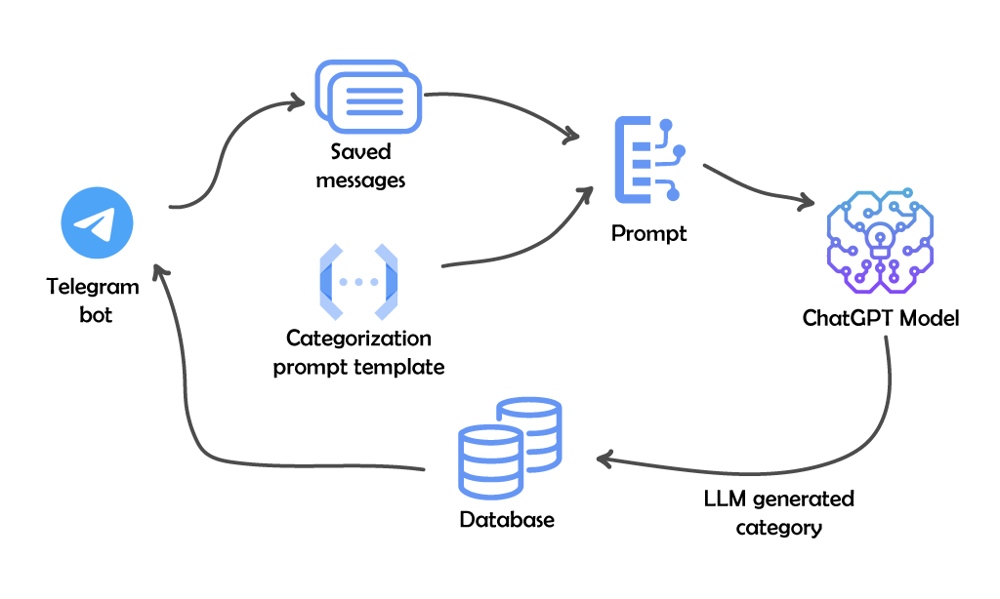

# Дизайн-документ для проекта ZeroInbox

> ## Термины и пояснения
>- **Пилот** - первоначальная реализация программного продукта или системы, которая используется для проверки концепции, оценки производительности и выявления возможных проблем в реальных условиях эксплуатации, но в ограниченном масштабе.

>- **Итерация** - ключевой элемент итеративных методологий разработки, где проект разбивается на небольшие части, и каждая из них разрабатывается, тестируется и оценивается в отдельном цикле.

## Оглавление
  - [1. Цели и предпосылки](#1-цели-и-предпосылки)
    - [1.1 Зачем идем в разработку продукта?](#11-зачем-идем-в-разработку-продукта)
    - [1.2 Бизнес-требования и ограничения](#12-бизнес-требования-и-ограничения)
    - [1.4 Что входит в цель проекта/итерации, что не входит](#14-что-входит-в-цель-проектаитерации-что-не-входит)
  - [2. Методология](#2-методология)
    - [2.1. Постановка задачи](#21-постановка-задачи)
    - [2.2. Блок-схема решения](#22-блок-схема-решения)
    - [2.3. Этапы решения задачи](#23-этапы-решения-задачи)
  - [3. Подготовка пилота](#3-подготовка-пилота)
    - [3.1. Способ оценки пилота](#31-способ-оценки-пилота)
    - [3.2. Что считаем успешным пилотом](#32-что-считаем-успешным-пилотом)
    - [3.3. Подготовка пилота](#33-подготовка-пилота)
  - [4. Внедрение](#4-внедрение)
    - [4.1. Архитектура решения](#41-архитектура-решения)
    - [4.2. Описание инфраструктуры и масштабируемости](#42-описание-инфраструктуры-и-масштабируемости)
    - [4.3. Требования к работе системы](#43-требования-к-работе-системы)
    - [4.4. Безопасность системы](#44-безопасность-системы)
    - [4.5. Безопасность данных](#45-безопасность-данных)
    - [4.6. Издержки](#46-издержки)
    - [4.5. Integration points](#45-integration-points)
    - [4.6. Риски](#46-риски)

## 1. Цели и предпосылки
### 1.1 Зачем идем в разработку продукта?
- **Бизнес-цели:**
    - Повышение продуктивности пользователей: возможность быстрее находить необходимые сохраненные сообщения.
    - Привлечение новых пользователей, заинтересованных в эффективной работе с сохраненными сообщениями.

- **Проблематика:**
    - Практически все пользователи Telegram используют личный чат "Saved Messages" для хранения сообщений, ссылок, личных заметок и т.д. Со временем этот чат превращается в бесконечную ленту сообщений, с которой неудобно взаимодействовать и в которой сложно что-то найти.

- **Преимущества использования ML/LLM:**
    - Автоматическая категоризация сообщений, основываясь на их содержимом, c помощью алгоритмов ML и LLM-моделей.
    - Улучшение точности поиска: более точные и эффективные алгоритмы поиска по категориям и ключевым словам.

- **Критерии успеха:**
    - Реализация функционала, позволяющего пользователям легко/удобно категоризировать/искать сохраненные сообщения.

### 1.2 Бизнес-требования и ограничения
- **Бизнес-требования:**
    - Создание интерфейса (бота) для взаимодействия (категоризации и поиска) с сохраненными сообщениями в Telegram.

- **Бизнес-ограничения:**
    - Бот должен быть легко интегрируемым в существующую экосистему Telegram и не требовать значительных изменений/усилий со стороны пользователя.

- **Итерации проекта**
    - **Первая итерация:**
        - Создание базовой версии для проверки `POC`, с категоризацией сообщений по предопределенным классам.
    - **Вторая итерация:**
        - Реализация `MVP` сервиса с интеграцией в Telegram и возможностью создавать и назначать собственные категории, удобным интерфейсом поиска и просмотра сообщений.
    - **Третья итерация:**
        - Тестирование сервиса, в том числе в реальных условиях с ограниченным количеством пользователей.
        - Cбор фидбека пользователей.
    - **Четвертая итерация:**
        - Исправление/оптимизация функционала на основе фидбека пользователей
        - Продвижение и поддержка сервиса.

- **Бизнес-процесс пилота:**
    - Пользователи тестируют бота, используя его для категоризации своих сохраненных сообщений и поиска по ним.
    - Пользователи отправляют обратную связь по мере использования бота, которая будет анализироваться.

- **Успешный пилот:**
    - Пользователи активно используют бота, положительно оценивают удобство его использования и эффективность категоризации и поиска.

## 2. Методология
### 2.1. Постановка задачи
- Разработка бота для Telegram, который с помощью LLM-модели будет анализировать и категоризировать сохранённые пользователем сообщения.

- Создание удобного инструмента для работы с сохраненными сообщениями, который позволит пользователю быстро находить нужную информацию.

### 2.2. Блок-схема решения

### 2.3. Этапы решения задачи

- **Первая итерация:**
    - Создание дизайн документа (будет обновляться в процессе выполнения проекта).
    - Разработка простой LLM-based модели для категоризации текстовых сообщений и ссылок на основе предопределенных классов.
    - Создание базовой инфраструктуры для работы бота:
        - база данных (PostgreSQL) для хранения категоризированных данных.
- **Вторая итерация:**
    - Создание пользовательского интерфейса с использованием Telegram API.
    - Расширение функциональности бота:
        - добавление пользовательских категорий.
        - поиск по категориям и сообщениям.
        - фильтрация и сортировка сообщений.
    - Развертывание бота.
- **Третья итерация:**
    - Разработка функционала сбора обратной связи пользователей.
    - Запуск MVP среди ограниченной группы пользователей.
    - Подготовка тестовых данных:
        - Выбор части сохраненных сообщений создателей бота.
        - Данные на основе сбора обратной связи от группы пользователей бота.
        - Скраппинг reddit, в качестве сообщений - заголовки постов, а наименование темы поста (topic name) в качестве категории.
    - Анализ ошибок на тестовых данных:
        - В случае использования собственых сообщений и обратной связи пользователей можно ориентироваться на human-based оценке: релевантно ли бот определил категорию.
        - В случае использования данных с reddit можно непосредтсвенно оценить метрику категоризации. Учитывая тот факт, что одно и тоже сообщение можно отнести к разным классам (например `programming` или `technology`) для оценки качества классификации будет использоваться метрика `Recall` для бинарной классификации, где неопределенный класс(`unknown`) получает метку 0, остальные классы - 1.
- **Четвертая итерация:**
    - Внесение измненений в функционал/модель исходя из анализа ошибок на предыдущем этапе.
    - Проверка альтернативных подходов к классификации (например, Semantic Router: https://github.com/aurelio-labs/semantic-router).
    - Покрытие кодовой базы тестами.

## 3. Подготовка пилота
### 3.1. Способ оценки пилота
- **С точки зрения бизнеса:**
    - Анализ пользовательского вовлечения: отслеживание количества активных пользователей, частоты использования функций категоризации.
    - Опросы пользователей: сбор обратной связи о пользе и удобстве использования бота.

- **С точки зрения ML-специалиста:**
    - Точность категоризации: оценка точности автоматической категоризации сообщений.
    - Скорость обработки: измерение времени, необходимого для обработки и категоризации сообщений.

### 3.2. Что считаем успешным пилотом
- Положительные отзывы пользователей о функциональности и удобстве использования бота.
- Высокая точность автоматической категоризации сообщений (например, Recall более 95%).
- Быстрая обработка сообщений, не вызывающая заметных задержек для пользователя.

### 3.3. Подготовка пилота
- **Оценка вычислительных затрат:**
    - Расчёт примерного количества запросов к API Telegram и OpenAI (если используется для категоризации) для оценки затрат на обработку.

- **Эксперимент с бейзлайном:**
    - Разработка и тестирование базовой модели категоризации на небольшом наборе данных для определения её эффективности и вычислительной сложности.
    - Сравнение результатов базовой модели с тестовыми данными с Reddit для оценки точности.

- **Уточнение параметров:**
    - На основе результатов эксперимента с бейзлайном корректировка параметров модели категоризации для улучшения точности и снижения вычислительных затрат.

- **Готовность инфраструктуры:**
    - Настройка серверной инфраструктуры для обеспечения надёжного и безопасного функционирования бота.
    - Разработка механизмов мониторинга и логирования для отслеживания работы бота и выявления возможных проблем.
    - Интеграция бота с API Telegram.

- **Тестирование и оптимизация:**
    - Проведение тестирования бота на различных типах и объемах сообщений для проверки его функциональности и производительности.
    - Оптимизация алгоритмов обработки и категоризации сообщений для ускорения их выполнения и снижения нагрузки на сервера.

- **Подготовка к запуску:**
    - Генерация авто-документации с помощью `Sphinx`.
    - Разработка `Docker`-контейнера для обеспечения удобного и стандартизированного развёртывания бота на различных платформах и окружениях.
    - Планирование стратегии ролл-аута пилотной версии бота, включая выбор целевой аудитории и каналы коммуникации.

## 4. Внедрение
### 4.1. Архитектура решения
- **Telegram Bot (Telethon):** Основной интерфейс взаимодействия с пользователем. Отправляет сохраненные сообщения на обработку в сервис категоризации и возвращает результаты пользователю. Также бот предоставляет интерфейс для поиска и фильтрации сообщений по категориям.

- **Сервис категоризации (OpenAI API):** Этот сервис принимает текст сообщений от бота, анализирует их содержимое и возвращает категорию, к которым относится сообщение.

- **База данных (PostgreSQL)**: Хранение информации о сообщениях и их категориях. Это позволяет быстро и эффективно осуществлять поиск и фильтрацию сообщений по различным критериям.

**Методы API:**
> WIP: To be completed later.

### 4.2. Описание инфраструктуры и масштабируемости
> WIP: will be updated later

**Инфраструктура:**
- **Облачный сервер:** Бот будет развернут в облачной инфраструктуре, это обеспечит гибкость в управлении ресурсами, масштабируемость и высокую доступность.

### 4.3. Требования к работе системы
- **SLA:** Система должна быть доступна 99.9% времени.

- **Пропускная способность:** Обработка сообщений в реальном времени с минимальной задержкой.

### 4.4. Безопасность системы
- **Аутентификация:** Проверка подлинности пользователей через Telegram API.

- **Шифрование:** Использование HTTPS для шифрования данных во время передачи.

### 4.5. Безопасность данных
- **Взаимодействие с внешними сервисами:** Единственным внешним сервисом, с которым бот обменивается данными, является OpenAI API. Все запросы к этому сервису проходят через защищенное соединение (HTTPS), обеспечивающее конфиденциальность и целостность передаваемых данных.

- **Категоризация данных:** Для категоризации сообщений бот отправляет в OpenAI API только текст сообщения без каких-либо персональных данных пользователя. Таким образом, минимизируется риск утечки конфиденциальной информации.

- **Хранение данных:** В базе данных PostgreSQL бот хранит только хеш от Telegram api_id пользователя, что предотвращает возможность идентификации пользователя по данным, хранящимся в базе.

### 4.6. Издержки
Расчетные издержки на работу системы в месяц могут включать следующие компоненты:
- **Стоимость облачного хостинга:**
    Зависит от выбранного облачного провайдера и конфигурации сервера. Например, использование виртуальной машины среднего размера (1 CPU, 4 GB RAM) на AWS или Google Cloud может стоить `около $30 в месяц`.

- **Стоимость использования OpenAI API:**
    OpenAI взимает плату за количество символов, обработанных их API. Стоимость может варьироваться в зависимости от объема текста, отправляемого на категоризацию. Например, если предположить, что средний размер сообщения составляет 100 слов и в месяц обрабатывается около 100_000 сообщений, при стоимости ~$0.0002 за 1 выполнение(execution), издержки на использование API составят `около $20`.

- **Затраты на техническую поддержку** и обновление системы могут варьироваться в зависимости от сложности и требований проекта.

**Примерный расчет общих издержек в месяц:**
- Облачный хостинг: `$30`
- Использование OpenAI API: `$20`

>Эти цифры являются приблизительными и могут варьироваться в зависимости от конкретных условий и требований проекта.

### 4.5. Integration points
> To be completed later.

### 4.6. Риски
- **API OpenAI:**
    - **Изменения в API:** OpenAI может вносить изменения в свой API, что потребует адаптации бота к новым требованиям или форматам данных.
    - **Ограничения и квоты:** Существуют ограничения на количество запросов и объем обрабатываемых данных, что может ограничить способность системы обрабатывать большой поток сообщений.
    - **Повышение стоимости:** OpenAI может повысить стоимость использования своих сервисов, что увеличит операционные расходы проекта.

- **Нагрузка на сервис:**
    - **Масштабируемость:** При росте числа пользователей и увеличении объема обрабатываемых сообщений может возникнуть необходимость в расширении инфраструктуры и увеличении ресурсов, что повлечет дополнительные затраты.
    - **Производительность:** Высокая нагрузка на сервис может привести к снижению производительности, увеличению времени ответа и ухудшению пользовательского опыта.
    - **Злоупотребление API:** Использование OpenAI API для категоризации контента, который может быть вредным или неэтичным.

- **DoS-атаки (Denial of Service):**
    - Система может стать мишенью для DoS-атак, при которых злоумышленники пытаются перегрузить сервис большим количеством запросов, что может привести к его временной недоступности.